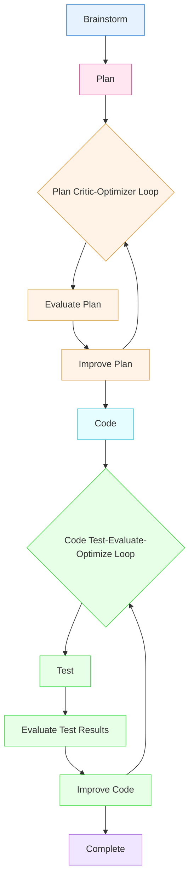

> Claude Code, Anthropic's agentic coding command-line interface (CLI) tool, has been a growing phenomenon.
>
> What we will cover:
>
> - A quick start for those who haven't tried it
> - Best practices and how to climb the ladder to being a Claude Code AI coding expert
<figure>
<picture>
  <source srcset="/assets/2025/Claude_code.png" type="image/png">
  
</picture>
</figure>

<!--more-->

Claude Code is Anthropic's agentic coding tool — a command-line interface (CLI) that lets you delegate coding tasks directly to Claude AI to automate development tasks. It understands your entire codebase and can work for extended periods across multiple files and tools to get tasks done.


## Levels of Coding Assistance

| Level | Description |
| ------- | ------------- |
| 0 | **Spicy autocomplete**: Tab-completion on steroids |
| 1 | **Intern**: Code boilerplate, comments, etc. |
| 2 | **Junior dev / pair programmer**: Review each other's code, delegate boring stuff |
| 3 | **Senior dev**: You are its manager and guide; it does most of the work |
| 4 | **Engineering team**: You work out longer tasks; it can work for hours |
| 5 | **Lights-out software factory**: You give it plain language; it goes and executes |

Source: [The Five Levels from Spicy Autocomplete to the Software Factory](https://www.danshapiro.com/blog/2026/01/the-five-levels-from-spicy-autocomplete-to-the-software-factory/) — Dan Shapiro

This guide should get you to level 2–3 and provide a roadmap to get to 4–5.

## Why is Claude Code a new improvement?

- **Excellent models**: Sonnet and Opus, multi-model to 'see' output, tool-calling, long 200k context window (1m for Opus and Sonnet with extra charges)
- **A simple, effective ReAct control loop**: Plan → code → test → iterate as necessary.
- **Plan-driven long-term memory**: It writes plans in `.md` files and uses them to stay on task. The ability to think and plan before acting, and then stay on plan, enables far longer and more complex work compared to vanilla single-turn LLM chat.
- **Rich internal tooling**: A plethora of internal tools and subagents to understand, find, and edit code — plus MCP tool integrations. Good tools that look up exact function signatures or retrieve precise documentation outperform generic web searches  or putting full code files in context, or large doc pages. (ChatGPT would often give answers from an outdated API due to training data cutoff; if you have a tool that fetches the exact doc or code you need, and patches a specific line of code, everything works better.)
- **Integration**: The CLI can do anything you can do on your computer from the command line, and control a browser. There is a growing community of skills, MCP servers and plugins, with strong third-party integration support. (OpenAI's Codex is good and adopting MCP and skills, but their strategy seems to be to push you toward their walled garden.)
- **Multi-tasking subagents**: Spawn isolated agents for parallel work.
- **Continuous improvement**: Anthropic can collect traces and up/down votes from Claude Code usage and integrate them into RLHF training, they have a flywheel going. More mature than OpenAI Codex and Gemini CLI which are closest comparisons. IDEs like Cursor, Windsurf, GitHub Copilot in VS Code are also developing agentic coding assistants. Combining Claude Code with your favorite IDE is most typical best practice.
- **Autonomous operation**: Can even run autonomously for many hours if you have the token quota and the right hooks.
- **Real-world reliability**: Claude Code can now solve complex problems and refactors, run for 30+ minutes on a complex plan without getting off track, understand brownfield codebases, produce minimal slop, get things 90%+ right, and fix most remaining issues iteratively.
- [Usable code output has climbed from < 50% to > 90%](https://crawshaw.io/blog/eight-more-months-of-agents)
- [Anthropic: How Claude Code Works](https://code.claude.com/docs/en/how-claude-code-works)
- [YouTube: How Claude Code Works](https://www.youtube.com/watch?v=RFKCzGlAU6Q)

With Claude Code, instead of being a developer with an assistant, you get promoted to the team lead of a team of agents planning and building stuff for you. You become more of a conductor leading an orchestra, and they do more of the work than was the case with GitHub Copilot, Cursor, Windsurf etc. And hopefully this makes you more productive. It's getting closer to the autonomous engineer we were promised with e.g. Devin.

Claude Code's power comes with a bit of a learning curve, but it's well worth it; let's get started.

## Getting Started

### Install

- [Set up Claude Code](https://code.claude.com/docs/en/setup)
- Pricing: [Pro](https://claude.com/pricing), [$100 and $200 Max plans](https://claude.com/pricing/max). Start with Pro to learn, once you do real work you will run out of tokens from time to time, Pro gives you limited tokens in a 4-5 hour window. Use `/status` to see where you are with usage and when it resets. Once you start developing big plans that code for 30 minutes, you will run out very fast in Pro, need a $100 Max plan. The $200 plan is if you have multiple sessions and sub-agents running at once, or otherwise are running out in the $100 plan.
- This post is about the CLI. You can also use Claude Code within the desktop app and Web UI, but it is much more sandboxed out of the box. As a CLI running in your terminal without explicit permission restrictions and sandboxing, Claude Code can do anything you can do (so be careful!).

### Claude.md - super important

- **`/init`** — Sets up `CLAUDE.md` file at project level, analyzes an existing project and saves what it thinks it needs to know to work in the project.
- **Project-level** - `CLAUDE.md` in repo root or `./.claude/CLAUDE.md` - Shared team instructions committed to git. Rules, conventions, and context about how the repo works that every contributor (human or AI) should follow.
- **User global** - `~/.claude/CLAUDE.md` - Your preferences in your home directory that apply across all projects. Style preferences, default behaviors, and personal rules that follow you everywhere.
- **Project memory (local)** - `CLAUDE.local.md` - Personal project-specific preferences, not committed to git, each dev has their own.
- **Managed** System directory like : `/etc/claude-code/CLAUDE.md` (or similar system directory on other OSes). IT administrators can set up preferences for all users.
- **`Add to CLAUDE.md: ...`** — puts it in the project instructions file
- **`/memory`** — helps you manage memory. Claude.md should generally be rules about the project that you curate carefully. Auto memory is facts and context about the project that Claude discovers and stores automatically.
- Keep `CLAUDE.md` short: definitely under 150 lines, ideally ~50. Longer files risk Claude forgetting items within them.
- [claude.md starter kit](https://github.com/abhishekray07/claude-md-templates) — Point Claude at this repo and say: *"Improve CLAUDE.md based on these criteria."*
- You can do multiple passes of *"check my repo changes and update CLAUDE.md"* — and update it regularly. It's a living document describing how your repo works and how you like to develop.
- [Memory](https://code.claude.com/docs/en/memory)

### Essential Commands and Navigation

- Start `claude` in the root of your project, Claude.md and other files are typically project-specific.
- **`/` commands** — Type `/` to see all available commands.
- tab - Autocomplete commands and file paths
- `Up` / `Down`Navigate prompt history (works across sessions)
- **`/status`** — Show current session status.
- **Status line** — Customizable; you can display context usage %, etc. using `/statusline`. Try `/statusline what can I display?`, `/statusline set up a status line showing cwd, model, context percentage, with a progress bar` . It's a shell script, can access any environment variables, commands like `git status`, etc. Docs: [Status Line](https://code.claude.com/docs/en/statusline)
- **`[Shift+Tab]`** — Toggle between Plan mode (don't code, just plan), and Default mode (prompt before code edits), and Auto-accept mode (accept all code edits).
- **`@` files** — Reference specific files in prompts with `@myfile.txt`.
- **Drag and drop** images, or paste with **Ctrl+V** (not Cmd+V on Mac). Claude Code can read screenshots, images, diagrams. Paste a screenshot of a bug to fix. Or prompt it how to create an image output with Figma or Playwright, then check it, and iterate on it.
- **`/model`** — Switch between Sonnet and Opus.
- **`/ide`** — Claude can integrate with your IDE, see what you selected in IDE, read IDE listing errors etc., put proposed changes inline with diffs
- **`/vim`** — can use emacs (default) or vim keybindings in editor. `/keybindings` or open `~/.claude/keybindings.json` to customize all keybindings.
- **`/config`** — Many configuration options.
- **`/copy`** — Copy last response to clipboard.
- `Ctrl+R`Search prompt history
- **`/resume`** or **`claude --resume`** and **`claude --continue`** — Resume work in a previous conversation thread where you left off.
- **`[escape]`** — stop what it's doing if you forget to tell it something or it's going off the rails
- **`[escape] [escape]`** or **`/rewind`** — return to earlier point in conversation, get rid of digressive context
- `Ctrl+D Ctrl+D` Exit Claude Code
- Scan through all the commands with `/`. If you don't know something, ask Claude — it has built-in tools to look up its own docs for you.

## Dev Loop: Spec-Driven Development

### Recommended Plugins

- install via `/plugin`, I can't recommend these plugins strongly enough

- **context7** — Look up docs for any Python module (or other languages).

- **Superpowers** — Test-driven development workflow. Started as an open-source community project, now in the Anthropic plugin marketplace. Other similar plugins (these are not recommended, but give you a flavor of what people are doing):

  - **BMAD/Spec Kit**: Persona-based agents (Business Analyst, Architect, Developer, etc.), full PRD workflows — very heavyweight.

  - **OpenSpec**: Document-driven planning: Requirements → Design → Tasks → Changes (audit trail).

- **Python-oriented**:
  - `pyright-lsp`
  - `code-review`
- **Front-end**:
  - `frontend-design`
  - `playwright` — browser so Claude can visually check its work (or use the Chrome plugin; put your preference in `CLAUDE.md`, e.g., *"Always check changes using Playwright"*).
- [Official plugins](https://github.com/anthropics/claude-code/tree/main/plugins)
- [Plugin marketplaces](https://claudemarketplaces.com/)

### The Development Workflow



1. **Start in Plan mode** — Don't write code yet. Go back and forth with the LLM to critique and improve the plan.
2. **Shift+Tab** to toggle between Plan mode (blocks code writing), Default mode (prompts for changes), and Auto-accept mode (makes all changes).
3. **Pre-approve permissions** — You'll find you have to approve a lot of bash commands (reading the codebase, looking up docs). Use `/permissions` to pre-approve non-destructive commands like `ls`. You can also create an alias:
   ```bash
   alias claudeyolo='claude --dangerously-skip-permissions'
   ```
   But only use this in an environment where it can do no harm, like a throwaway VPC or container. Also consider adding hooks to block destructive commands like `rm` and `git`.
4. **Brainstorm the plan** — Say: *"I would like to brainstorm and create a plan to build [high-level intention]."* Then provide detailed info about what you want. The Superpowers plugin will ask questions to help write a plan.
5. **Read and edit the plan** — It's your project, not Claude's, especially at the planning stage. Ctrl-G opens the plan in the editor.
6. **Cross-check with another AI** — Use e.g. OpenAI Codex to review: *"What details and edge cases might I have missed?"* Iterate a few times. See: [Rule of 5 Passes over Design, Code, etc.](https://steve-yegge.medium.com/six-new-tips-for-better-coding-with-agents-d4e9c86e42a9)
7. **Visual aids welcome** — Give it a sketch, put ASCII art in the plan, or hook up the Figma plugin to mock up a UI.
8. **Ask questions** — e.g., *"What are the tradeoffs between storing data in JSON vs. SQLite vs. Markdown files?"*
9. **When the plan looks good, tell it to write the code.**
10. **Error recovery patterns** — If it goes off the rails, keeps producing broken code, or misunderstands the task (interrupt → clarify → `/rewind` → retry).
11. **Important: Include acceptance tests in the plan** — Give Claude a way to verify output: pytest, npm test, Playwright for UI, or rendering a PNG for graphical artifacts. Testable plans let it iterate, easily double the quality of the output. If you don't have tests, you don't have a full feedback loop, you are the 'test' part of the feedback loop.
12. **Do several passes of code review** — [Example prompt](https://www.reddit.com/r/ClaudeAI/comments/1q5a90l/so_i_stumbled_across_this_prompt_hack_a_couple/): *"Do a git diff and pretend you're a senior dev doing a code review and you HATE this implementation. What would you criticize? What edge cases am I missing?"* Go back and forth with OpenAI for diversity. Use the `code-review` plugin or [Turing Skill](https://github.com/turingmindai/turingmind-code-review).
13. **Fix what you missed** — You'll probably notice gaps; ask Claude to fix them.
14. **Don't be afraid to start over** — It's cheap. When you realize the architecture is wrong, tell it to write a detailed plan describing everything it did, then build a whole new version in a parallel directory. As Claude Code creator [Boris Cherny](https://www.reddit.com/r/ClaudeAI/comments/1q2c0ne/claude_code_creator_boris_shares_his_setup_with/) puts it: *"Knowing everything you know, design a more elegant solution."*

Do what works for you — different people have different workflows. If people can build C compilers and operating systems with these tools, you can probably build most CRUD GUIs. The key is good specs and a way to verify.

## Context Management Is The Key

Context management is the single most important skill for effective Claude Code usage.

- **Too little context**: Claude may not know APIs and will hallucinate, focus on the wrong things, or write overly defensive code.
- **Too much context**: Claude may forget or fail to retrieve important details.
- **Bad context**: Outdated or incorrect information leads to wrong answers.
- **Context rot**: Quality tends to fall when context reaches ~50% full.

Effective use of Claude Code is about giving it the right context at the right time, including using skills and Claude.md .

### Essential Context Commands

- **`/clear`** — Do one task, then clear context. The 200K token context window (or 1m if enabled with `/model`) is large but not all equally usable. `/clear` also saves on tokens, and time.
- **`/context`** — Shows what Claude is currently tracking: system prompt, `CLAUDE.md`, MCP servers, skills, and messages.
- **`/compact`** — Summarizes context, but it's somewhat of a black box. Prefer `/clear` and explicit, mindful context management over implicit `/compact` or auto-compact.
- **`/rewind`** (or **Esc Esc**) — If you had a digression to figure something out, rewind to an earlier point to "forget" useless context.
- **`/export`** — Save your context. Helpful if you want to review why Claude did what it did. Some people save at key checkpoints and even commit them to git.
- **`/resume`** — Scroll previous conversations and pick up where you left off.
- **Escape** — Anytime Claude is going off track, hit Escape to interrupt and redirect.

## Extensions

### Skills

- **Procedural knowledge** about how to do something with tools and subagents.
- Custom slash commands and skills have been merged, same thing now.
- Any boilerplate task — setting up a project, plan review, code review, security review — you can set up a skill so Claude does it the way you want.
- A skill is a `.md` file describing how to do something, with metadata (frontmatter), optionally with *scripts* and *context* file data. Importantly, skills always have access to a shell to run commands, that is their native 'tool'.
- [Anthropic: Complete Guide to Building Skills](https://resources.anthropic.com/hubfs/The-Complete-Guide-to-Building-Skill-for-Claude.pdf?hsLang=en)
- [Anthropic Docs: Skills](https://code.claude.com/docs/en/skills)
- Very easy to build — there's a built-in skill-builder skill. Just ask Claude to help.

### MCP Servers

- An MCP server is a Web server with REST tools Claude Code and AI generally can call as necessary, plus some metadata about when to use them. You configure Claude to say it has access to these tools and here's when to call them, just like skills. Anytime you ask Claude to do something, if it thinks the tool will help, it calls the tool and uses the output to respond.
- Use the **`/mcp`** command to manage servers.
- A couple of MCP servers is fine; 10+ might be too many. When MCP tool descriptions exceed 10% of your context, Claude automatically defers them and loads tool details on demand ("MCP Tool Search"). But it's better to start lean.
- A little harder to build than skills, but there's an MCP builder — ask Claude to help you create an MCP server as e.g. a Python script with FastMCP and tool decorators.
- [Connectors](https://claude.com/connectors): Third-party MCP integrations
- [MCP Documentation](https://modelcontextprotocol.io/docs/learn/server-concepts)

### Tools vs. Skills: When to Use What

It sounds like MCP is similar to skills, but code and a server are mandatory, whereas skills just use prompts and the shell out of the box. There is some overlap. In general, **prefer skills** if they are available. Skills are currently more context-efficient and performant. They use progressive disclosure: by default, only a small metadata summary is loaded; the full instructions load only when needed. MCP servers consume more context; if there are too many, Claude puts them into a meta-tool search index (search for the tool first, then load its details).

If a third party wants to expose functionality that lives on their server, they might host an MCP server you can connect to. But if they have a CLI that exposes the same functionality, packaging it as a skill will generally work better.

In both cases, if prompts aren't calling the tool/skill when you expect, you may need to improve the descriptive metadata or explicitly tell Claude to use it. If context gets large, Claude forgets things. If an MCP server has many tools, consider making a simpler version.

**CLIs are free context for skills.** Claude already knows how to shell out to `gh`, `aws`, `docker`, `psql`, `stripe`, etc. No tool definitions get loaded. No startup cost. 

| Task | CLI (preferred) | MCP (only if needed) |
| ------ | ----------------- | ---------------------- |
| GitHub operations | `gh pr create`, `gh issue list` | GitHub MCP |
| AWS operations | `aws s3 ls`, `aws ecs describe` | AWS MCP |
| Database queries | `psql -c "SELECT..."` | Postgres MCP |
| Docker management | `docker ps`, `docker logs` | Docker MCP |

**Skill-related tips:**

- Skills use progressive disclosure and can scale to many — only frontmatter/metadata loads by default.
- If a skill isn't triggering correctly, improve the frontmatter or prompt Claude explicitly to use it.
- Skills can include context data and accept arguments.
- Use MCP only for external integrations where a skill can't work.
- Useful meta-skills: `writing-skills`, `skill-creator` (Anthropic built-in skill).

### Plugins

- A plugin is a **packaging mechanism** to distribute skills, MCP servers, hooks, sub-agents, and their associated artifacts.
- Bundles skills (including definitions, scripts and data artifacts), hooks, subagents, MCP servers, into a single installable unit.


### Hooks

Hooks let you run something before or after a chat turn or tool executes.

- Use cases: formatters, linters, testers, guardrails.
- 14+ hook trigger points (and growing):  SessionStart, UserPromptSubmit, PreToolUse, PermissionRequest, PostToolUse, PostToolUseFailure, Notification, SubagentStart, SubagentStop, Stop, TeammateIdle, TaskCompleted, ConfigChange, PreCompact, SessionEnd.
- Run in YOLO mode (`alias claudeyolo='claude --dangerously-skip-permissions'`) but add a hook for destructive commands (`rm`, `git`, etc.).
- Put guidance in `CLAUDE.md` too, but a hook *guarantees* code will run when something happens.
- **Ralph Wiggum plugin**: A hook that intercepts the "stop" event, lets you test when a prompt completes to ensure it met spec, and resumes if necessary. You create a test/promise; on exit, it runs the test. If the desired result hasn't been achieved, it keeps going — enabling long-running prompts that perpetually find issues and fix them.
- **Hook Ideas**
  - PreToolUse — File Protection Guard to block edits on certain files
  - PostToolUse — Log tool use
  - SessionStart — Fetch some real-time stuff you always want initially in context

### CI/CD Integration

- PR review — Analyzes diffs, finds bugs, flags security issues (often catches logic errors humans miss while humans nitpick variable names).
- Code implementation — Comment "@claude implement this" on an issue, and it creates a PR with working code.
- Bug fixes — "@claude fix this bug" generates a fix PR.
- PR summaries — Generates human-readable summaries of large PRs for easier review.
- Release notes — Trigger on tag push to summarize all PRs in a release.
- CI debugging — Reads workflow logs and diagnoses failures.
- Resources
  - [Official GitHub Action](https://github.com/anthropics/claude-code-action)
  - [Anthropic docs: GitHub Actions](https://code.claude.com/docs/en/github-actions)
  - [GitHub Marketplace listing](https://github.com/marketplace/actions/claude-code-action-official)

### Security

- Claude Code CLI runs by default with all the permissions of the user and access to bash, which is too much for many enterprise environments. For instance my Docker was hung, I asked Claude Code to troubleshoot, it fixed it by deleting the troublesome container which was annoying because it had Postgres with some data (Langfuse). Claude Code CLI is [agentic browsers on steroids and crack](https://www.gartner.com/en/documents/7211030).
- To lock down the CLI
  - Claude Code has [managed settings](https://code.claude.com/docs/en/settings) that override command line arguments, local, project, and user settings. These scopes are parsed in order of precedence:
    - Managed settings (highest priority)
    - Command line arguments
    - Local settings
    - Project settings
    - User settings (lowest priority)
  - `/sandbox` command will let you configure a sandbox to run bash commands in a more restricted container environment.
  - `/permissions` command lets you set permissions regarding what tools Claude Code can access.
  - Set up hooks, always intercept some calls you might not like like `rm -rf /`.
  - Log everything via hooks
  - Connect to LLM via proxy and log what it's doing there. You could even have Claude Code point to a local model and never hit Anthropic using e.g. OpenRouter
  - Or consider running in a container with network allowlist to e.g. internal MCPs and select external websites. Can then sandbox at container level, only connect to internal-only MCP tools, some websites.
  - After writing some agents and skills, package into a web app that runs using Claude Agent SDK which is essentially running via Claude Code API, or headless `claude -p`
  - The desktop client and web UI are more locked down out of the box.

| | **Claude Code CLI** | **Claude.ai (Desktop & Web)** |
|---|---|---|
| **Where Skills bash tool runs** | Your local machine | Anthropic cloud container |
| **OS** | Your OS (macOS/Linux/WSL) | Ubuntu 24 (sandboxed) |
| **Working directory** | Your project directory | `/home/claude` |
| **Filesystem** | Your real filesystem | Ephemeral (resets between tasks) |
| **User files** | Direct access in project | `/mnt/user-data/uploads` (read-only) |
| **Output files** | Written in place | `/mnt/user-data/outputs` |
| **Skills system** (`/mnt/skills/`) | ❌ Not available | ✅ Yes |
| **Network access** | Full (your network) | Restricted allowlist |
| **Persistence** | Persistent (your disk) | Resets per session |
| **MCP servers** | ✅ Local config (`~/.claude/`) | Via API calls in artifacts |
| **Package install** | Normal (`pip`, `npm`) | `pip --break-system-packages`, `npm` |
| **Desktop MCP Extensions** |  ✅  | ✅ Desktop app only; Install MCP servers with one click, admin-controlled permissions |
| **Cowork mode** | ❌ No Cowork CLI | ✅ Mac Desktop app only (macOS) |


## Advanced Topics

### Worktrees

A lot of time is spent waiting for Claude — what do you do? Work on multiple things simultaneously without them clobbering each other.

- Git worktrees share the same `.git` subfolder.
- Can be annoying if they conflict on npm ports; you can pre-warm 5 worktrees with dependencies.
- [worktrunk](https://github.com/max-sixty/worktrunk) — A CLI for making worktrees easy.
- [conductor.build](https://www.conductor.build/) — Mac GUI for managing multiple Claude Code sessions; takes away the complexity of working with worktrees and multiple sessions.
- Can also use multiple terminals / tmux

### Subagents

**Multi-agent orchestration pattern.** Each subagent runs in its own isolated context with its own tools, model, and permissions — like spinning up a fresh Claude session for a specific task. This keeps the main context clean. In contrast, skills are called in the current context.

**Note**: Subagents *cannot* spawn other subagents. If you need nested delegation, chain subagents from the main conversation, or use skills.

##### Built-in agents

Claude Code ships with several built-in subagents it uses automatically:

| Agent | Model | Role |
|-------|-------|------|
| **Explore** | Haiku | Codebase search and exploration (read-only) |
| **Plan** | Inherits | Gathers context before presenting a plan (read-only) |
| **General-purpose** | Inherits | Complex research + code modifications |
| **Bash** | Inherits | Terminal commands in a separate context |
| **statusline-setup** | Sonnet | Configures your `/statusline` |
| **Claude Code Guide** | Haiku | Answers questions about Claude Code itself |

##### Managing agents

- **`/agents`** — browse, create, and manage agents interactively. Select *Create new agent*, describe what it does, pick tools, model, and background color.
- **Explicit invocation**: *"Use the code-reviewer subagent to look at my recent changes"* — Claude delegates to a specific agent on request.
- **Auto-delegation**: Claude automatically picks the right subagent based on your request and each agent's `description` field.

##### Creating custom subagents

A subagent is a `.md` file with YAML frontmatter + a system prompt. Two scopes:

- **Project**: `.claude/agents/name.md` — committed to git, team-shared
- **User**: `~/.claude/agents/name.md` — personal, available in all projects

Example:

~~~markdown
---
name: code-reviewer
description: Expert code review. Use proactively after writing or modifying code.
tools: Read, Grep, Glob, Bash
model: sonnet
---

You are a senior code reviewer. Run git diff, review modified files, and report:
- Critical issues (must fix)
- Warnings (should fix)
- Suggestions (consider improving)
~~~

Key frontmatter fields:

| Field | Description |
|-------|-------------|
| `name` | Unique identifier (lowercase, hyphens) |
| `description` | When Claude should delegate to this agent — write this carefully |
| `tools` | Allowlist of tools; inherits all if omitted |
| `disallowedTools` | Denylist of tools |
| `model` | `sonnet`, `opus`, `haiku`, or `inherit` (default) |
| `permissionMode` | `default`, `acceptEdits`, `dontAsk`, `bypassPermissions`, or `plan` |
| `maxTurns` | Max agentic turns before stopping |
| `skills` | Skills to inject at startup (full content, not lazy-loaded) |
| `mcpServers` | MCP servers available to this agent |
| `memory` | `user`, `project`, or `local` — enables persistent cross-session learning |
| `background` | `true` to always run as a background task |
| `isolation` | `worktree` — runs in a temporary git worktree, cleaned up after |
| `hooks` | Scoped lifecycle hooks (`PreToolUse`, `PostToolUse`, `Stop`) |

You can also define session-only agents at launch:
```bash
claude --agents '{"code-reviewer": {"description": "...", "prompt": "...", "tools": ["Read", "Grep"]}}'
```

##### Foreground vs. background

- **Foreground** (default): blocks the main conversation, permission prompts pass through to you.
- **Background**: runs concurrently while you keep working. Claude asks for tool permissions upfront, then auto-denies anything not pre-approved. Press **Ctrl+B** to background a running task, or ask: *"run this in the background."* MCP tools are not available to background agents.

#### Persistent memory

Give a subagent memory that builds up over time across sessions:

```yaml
memory: user      # ~/.claude/agent-memory/<name>/ — all projects
memory: project   # .claude/agent-memory/<name>/ — project-specific, shared via git
memory: local     # .claude/agent-memory-local/<name>/ — project-specific, gitignored
```

First 200 lines of the agent's `MEMORY.md` load into every session. Prompt it: *"Check your memory before starting, and update it when done."*

##### Worktree isolation

```yaml
isolation: worktree
```

Runs the agent in a temporary git worktree — a clean copy of the repo. Great for risky experiments. The worktree is automatically deleted if no changes are made.

##### Resuming subagents

Each invocation starts fresh. To continue a previous run: *"Continue that code review and now analyze the authorization module."* Claude resumes with full conversation history. Transcripts live at `~/.claude/projects/{project}/{sessionId}/subagents/`.

##### Good use cases

- **Code review**: isolated context, read-only tools — *"Have the code-reviewer check my recent changes"*
- **Deep research**: send it to gather findings without polluting the main context
- **Parallel work**: multiple background agents on independent tasks
- **Risky experiments**: use `isolation: worktree` so it can't break your working tree
- **Persistent specialists**: a `debugger` or `data-scientist` agent that builds domain knowledge over time via `memory`

- [Docs: Creating Custom Subagents](https://code.claude.com/docs/en/sub-agents#create-custom-subagents)
- [Awesome Claude Code Subagents](https://github.com/VoltAgent/awesome-claude-code-subagents)

### Agent Teams

Agent teams let you coordinate multiple Claude Code instances working together. One session acts as the **team lead**, coordinating work and assigning tasks. **Teammates** work independently, each in its own context window, and can communicate directly with each other — not just with the lead.

> **Status**: Experimental. Enable by adding to `settings.json`:
> ```json
> { "env": { "CLAUDE_CODE_EXPERIMENTAL_AGENT_TEAMS": "1" } }
> ```

####@ Subagents vs. Agent Teams

| | Subagents | Agent Teams |
|--|--|--|
| **Context** | Own window; results return to caller | Own window; fully independent |
| **Communication** | Report back to main agent only | Teammates message each other directly |
| **Coordination** | Main agent manages all work | Shared task list, self-coordinating |
| **Best for** | Focused tasks where only result matters | Complex work needing discussion and collaboration |
| **Token cost** | Lower | Higher (each teammate is a full Claude instance) |

Use **subagents** when you need quick, focused workers that report results back. Use **agent teams** when workers need to share findings, challenge each other, and coordinate on their own.

##### Starting a Team

Tell Claude what you want in natural language — it creates the team, spawns teammates, and coordinates based on your prompt. This works well because the three roles are independent:

```
Create an agent team to design a CLI TODO tracker: one teammate on UX,
one on technical architecture, one playing devil's advocate.
```

Or be explicit about size and models:

```
Create a team with 4 teammates to refactor these modules in parallel.
Use Sonnet for each teammate.
```

##### Architecture

| Component | Role |
|-----------|------|
| **Team lead** | Main session that creates the team, spawns teammates, coordinates work |
| **Teammates** | Separate Claude Code instances, each working on assigned tasks |
| **Task list** | Shared list of work items teammates claim and complete (with dependency tracking) |
| **Mailbox** | Messaging system for direct agent-to-agent communication |

Team config and tasks are stored locally:
- `~/.claude/teams/{team-name}/config.json`
- `~/.claude/tasks/{team-name}/`

##### Display Modes

- **In-process** (default): all teammates run inside your terminal. Use `Shift+Down` to cycle through teammates and talk to them. Press `Ctrl+T` to toggle the task list.
- **Split panes**: each teammate gets its own pane. Requires `tmux` or iTerm2 with the `it2` CLI.

```json
{ "teammateMode": "in-process" }   // settings.json
```
```bash
claude --teammate-mode in-process  // override per session
```

The default `"auto"` uses split panes if already inside `tmux`, otherwise in-process.

##### Controlling the Team

**Assign tasks**: tell the lead to assign specific work to specific teammates, or let teammates self-claim from the shared task list after finishing.

**Plan approval**: require teammates to plan before implementing:
```
Spawn an architect teammate to refactor auth. Require plan approval before they make changes.
```
Teammates stay in read-only plan mode until the lead approves; the lead can reject with feedback.

**Talk directly to teammates**: in in-process mode, `Shift+Down` cycles to any teammate — type to send them a message or hit `Escape` to interrupt their turn.

**Shut down teammates**:
```
Ask the researcher teammate to shut down.
```

**Clean up** (always do this from the lead, not a teammate):
```
Clean up the team.
```

##### Quality Gates via Hooks

- **`TeammateIdle`** — runs when a teammate finishes; exit code 2 keeps the teammate working with feedback.
- **`TaskCompleted`** — runs when a task is being marked complete; exit code 2 blocks completion and sends feedback.

##### Best Use Cases

- **Parallel code review**: spawn a security reviewer, a performance reviewer, and a test-coverage reviewer simultaneously — each applies a different lens to the same PR.
- **Competing hypotheses for debugging**: each teammate investigates a different root cause theory and actively tries to disprove the others'.
- **New features across layers**: frontend teammate, backend teammate, test teammate each own their piece without stepping on each other.
- **Research with multiple angles**: explore a design space in parallel (UX, architecture, devil's advocate) and synthesize findings.

##### Best Practices

- **Give teammates enough context in the spawn prompt** — they don't inherit the lead's conversation history.
- **Size tasks right**: too small and coordination overhead exceeds the benefit; too large and mates work too long without check-ins. Aim for 5–6 tasks per teammate.
- **Avoid file conflicts** — break work so each teammate owns different files.
- **Start with research/review tasks** to get comfortable before attempting parallel implementation.
- **Monitor and steer** — check in on teammates, redirect failing approaches early.
- **Start with research and review** — less coordination risk than parallel implementation.

##### Limitations

- `/resume` and `/rewind` don't restore in-process teammates.
- Task status can lag — teammates sometimes fail to mark tasks complete.
- One team per session; teammates can't spawn sub-teams.
- Split panes require `tmux` or iTerm2 — not supported in VS Code terminal, Windows Terminal, or Ghostty.

- [Docs: Agent Teams](https://code.claude.com/docs/en/agent-teams)

### Ralph

The [Ralph Wiggum technique, created by Geoffrey Huntley](https://ghuntley.com/loop/), is a method for running Claude Code in autonomous loops that iterate until a task is complete — named after the lovably persistent Simpsons character. It's now in the officially maintained Anthropic marketplace directory.
- [Claude plugin](https://github.com/frankbria/ralph-claude-code)
- [How to Ralph Wiggum](https://github.com/ghuntley/how-to-ralph-wiggum)


### Frontier stuff

- [Steve Yegge's Gas Town](https://steve-yegge.medium.com/welcome-to-gas-town-4f25ee16dd04) , multiple instances of agents that share memory, talk to each other
- [Jeff Emanuel's Agent Flywheel](https://agent-flywheel.com/) . Similar, can work across Claude Code, OpenAI Codex, Gemini CLI

## Other Best Practices / Recap

- **Keep asking questions** — Claude Code can tell you how to use itself, how to write prompts, and how to build things. If you want to learn subagents, ask: *"I do this task a lot; I'd like to make a custom subagent that can accomplish it."*
- **Get the right plugins for your task**:
  - `context7` — Pull in all the docs.
  - Front-end: `frontend-design`, Playwright (so Claude can see its output).
  - Python: `pyright-lsp` for parse tree understanding, `code-review` for code review and simplification.
- **Use the Superpowers plugin for brainstorming**, or OpenSpec for document-driven plans.
- **Always start in Plan mode.**
- **Be as specific as possible** when telling Claude Code what do do, but try not to clutter the context with irrelevant details, or Claude may forget important details. It can help to specify skills and tools you want Claude to use, like: check the latest Claude docs with `claude-code-guide`.
- **`/clear` context often**, saves tokens and works faster and better without confusing Claude. Docs: [Reducing token usage](https://code.claude.com/docs/en/costs#reduce-token-usage)
- **Git integration** — Claude Code has native awareness of `git diff`, branch context, and how to leverage it for PR descriptions, commit messages, and changelog generation. There is a github plugin. **Commit often.**
- `/doctor` for info about config, current v. stable version. Some way wish to keep people on the latest stable version. Update version with `claude update`
- Opus for complex planning and complex tasks, can usually use Sonnet for coding (managing token cost); switch with `/model`.
- **Multiple plan iterations for complex work** — Tell Claude to write the plan to an `.md` file, edit it yourself, ask a different AI (like Codex) to review.
- **The dev loop**: Plan → Code (with tests) → Code review → Iterate.
- **The "god prompt"**: *"You're a cranky senior developer who hates me and my code. Tell me everything that's wrong — all the edge cases I missed."*
- **It's cheap to throw away and start over** — Say: *"Write a new version that does the same thing but structures it like this."* The previous version functions as a spec. You may do this 2–3 times, because the first build reveals what you were missing, then you add the kitchen sink ([Brooks's Second-System Syndrome](https://en.wikipedia.org/wiki/Second-system_effect)), then you realize much of the additions are unnecessary or simpler approaches can be generalized.
- **Sandbox as thoroughly as possible** — You might be tempted to develop with access to a production resource like a database or API — don't. All bets are off. YOLO in a sandbox, then PR into a feature branch when something works.
- **Voice input** — Some people swear by Wispr Flow voice keyboard for talking to Claude Code.
- **Give logs and screenshots** of what happened to help troubleshoot.
- **Headless/CI mode** — Running Claude Code in CI pipelines (`claude -p "prompt" --output-format json`) for automated code review, test generation, or migration tasks. Can use **`--max-turns`** to control how many autonomous steps Claude takes before stopping for human review. Example: Pipe a log file to Claude:
`cat build-error.txt | claude -p 'concisely explain the root cause of this build error' > output.txt`
`cat code.py | claude -p 'analyze this code for bugs' --output-format json > analysis.json`
`find --help | claude -p 'read this and find all .py files modified in the last 7 days larger than 10kb'`
`ffmpeg --help full | claude -p 'read this and give me the command to extract audio from input.mp4 as 128kbps mp3'`
- **SDK/library mode** — Use [Claude Code as a module](https://platform.claude.com/docs/en/agent-sdk/overview) from other scripts or a UI, building custom agentic workflows.

## Concluding remarks

- [The documentation is excellent](https://code.claude.com/docs/en/overview).
  - [Common workflows](https://code.claude.com/docs/en/common-workflows)
  - [Best practices](https://code.claude.com/docs/en/best-practices).
  - [Failure patterns](https://code.claude.com/docs/en/best-practices#avoid-common-failure-patterns)

- Anyone can vibe-code and be (sort of) a 10x coder now...If you have been waiting to get started, wait no more!


Further reading:

- [Claude Code Tips](https://github.com/ykdojo/claude-code-tips)
- [Roadmap.sh Step-by-Step guide to becoming a Claude Code expert in 2026](https://roadmap.sh/claude-code)

