This is a tutorial on running Jupyter Notebook on an Amazon EC2 instance. It is based on a [tutorial](https://chrisalbon.com/software_engineering/cloud_computing/run_project_jupyter_on_amazon_ec2/) by Chris Albon, which did not work for me immediately (itself based on a [tutorial by Piyush Agarwal](http://blog.impiyush.me/2015/02/running-ipython-notebook-server-on-aws.html)). So I tweaked a few things and got it working.

# Use cases for AWS (Who doesn't love AWS?)

- Scale up - get a giant instance that runs an algo on big data faster than your PC.
- Scale out - run many notebooks at once.
- Access resources you can't or, don't want to install on local PC: GPU, Postgres, etc.
- Everybody in industry uses it.

# Prerequisite) Set up your AWS account - I won't go over that. But 2 recommendations:

- Set up [2-factor authentication](https://aws.amazon.com/iam/details/mfa/). Who hasn't had a password compromised? With 2FA, if your AWS password gets compromised, you don't lose everything in your account. And you don't have someone run up a huge AWS bill mining Bitcoin, or spamming the world.
  - I use the [Google Authenticator](https://itunes.apple.com/us/app/google-authenticator/id388497605?mt=8) smartphone app
  - Or, use a hardware key like [Yubikey](http://www.1strategy.com/blog/2018/05/08/lock-down-your-aws-account-with-yubikey/) which is even more secure, doesn't depend on having your phone, Internet access. ([People have hacked code-based 2FA](https://www.csoonline.com/article/3272425/authentication/11-ways-to-hack-2fa.html) by compromising your phone, getting you to enter your code on the Web)
- Set up [billing alerts](https://docs.aws.amazon.com/AmazonCloudWatch/latest/monitoring/monitor_estimated_charges_with_cloudwatch.html) so you get notified when your monthly bill exceeds e.g. $50.

# 1) Create an instance

- Log into the [AWS console](https://console.aws.amazon.com/) 

  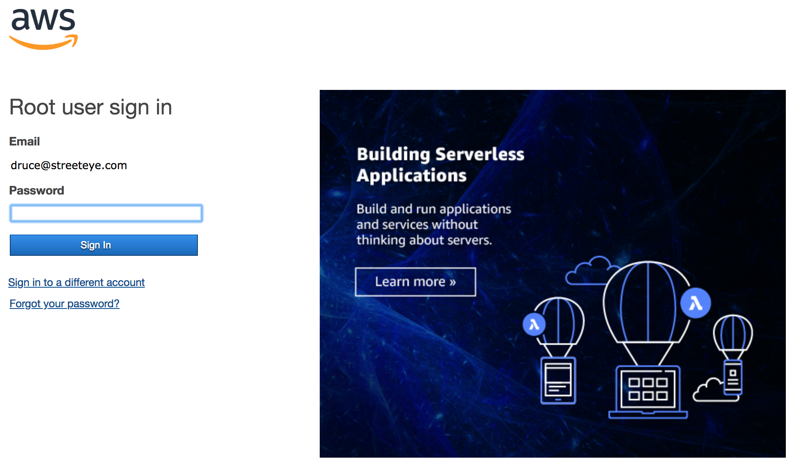
- Click on "EC2"

  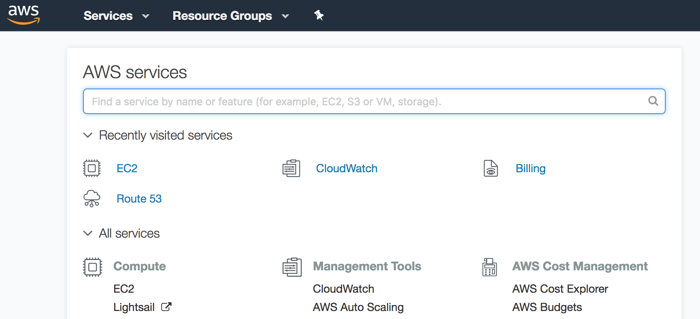
- Click on "Launch instance"

  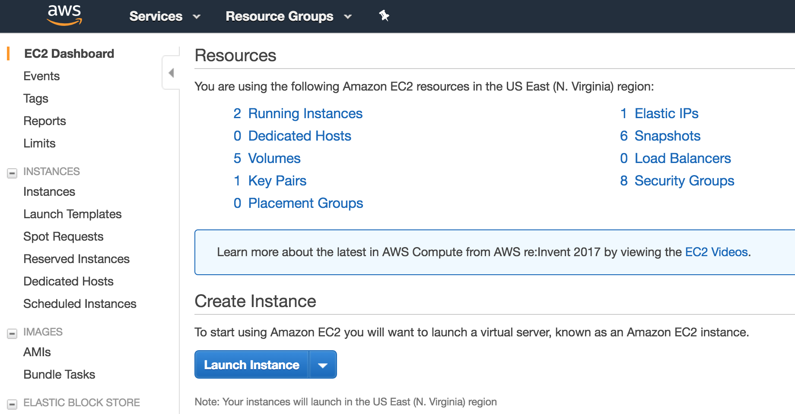
- Choose an Amazon Machine Image (AMI) - Ubuntu 18.04 LTS. 

  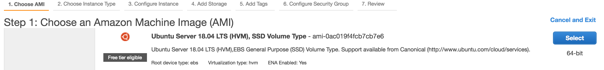

  - In general, choose latest Ubuntu LTS (Long Term Support), HVM virtualization, SSD storage. (Exception: when the latest Ubuntu is very new, give it ~6 months to mature, ensure all software, especially drivers are available and tested, e.g. GPU)
- Choose an instance type, click "Next: Configure Instance Details": for this demo choose the free tier eligible micro instance

  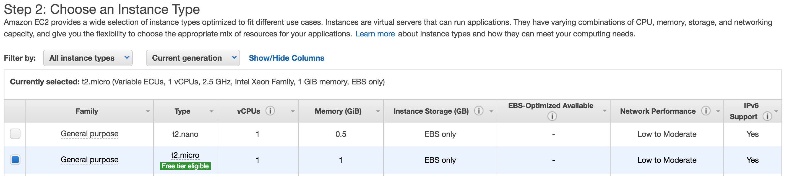
- Choose "Next: Add Storage" (Shouldn't have to modify anything on this page)

  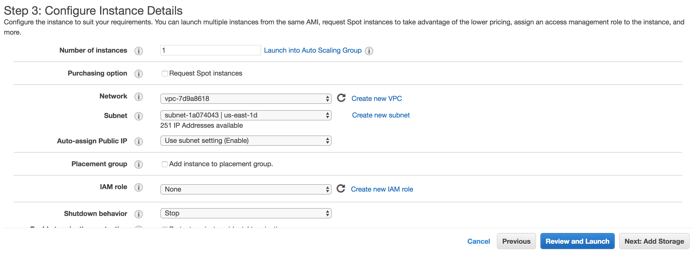
- Set a reasonable amount of storage, like 30GB (more if you have a big dataset). Click "Next: Add Tags"

  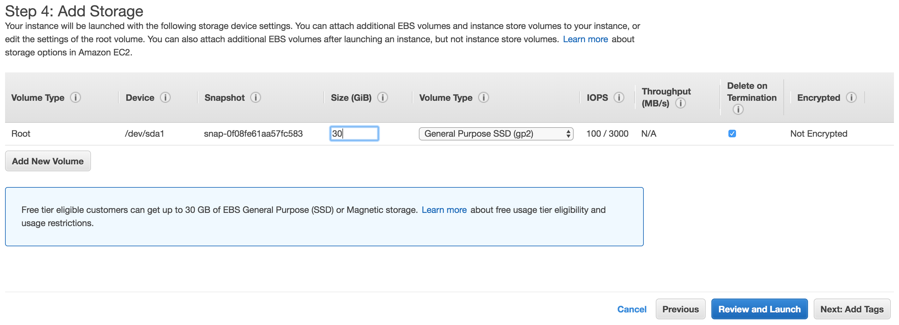
- Click "Next: Configure Security Group" (You don't need to modify anything on this page. Tags help you keep track of servers and other resources, when you have a lot of them)

  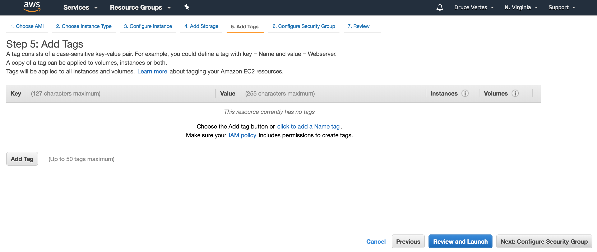

  - Create a new security group like 'Jupyter'.

    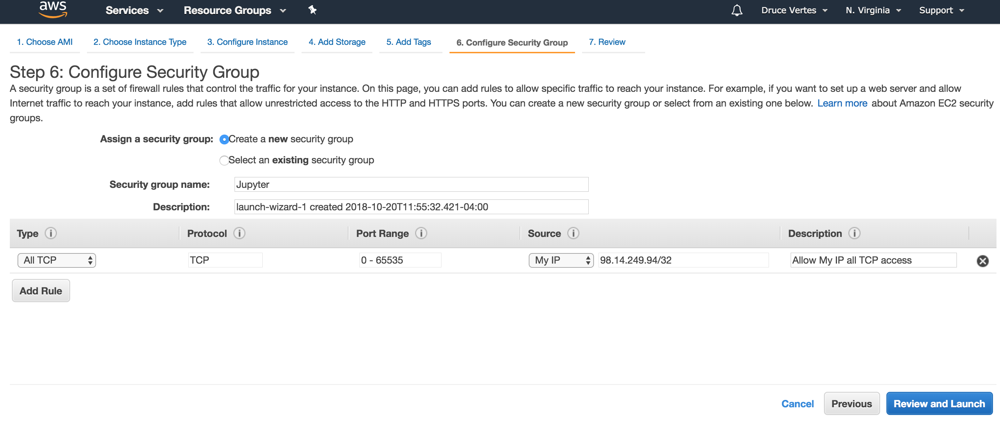
  - Click "Add rule"
  - Set Type: All TCP
  - Set Source: My IP
  - Click the x at far right to delete the first rule
  - What this means: Allow all access from my IP, no access from anywhere else (default was SSH from anywhere)
  - Click "Review and Launch"
  - Click "Launch"

    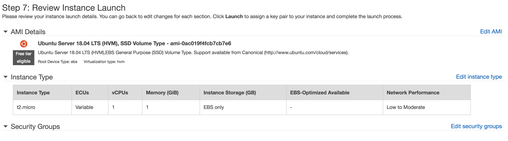
- Almost there! 
- Choose "Create key pair"

  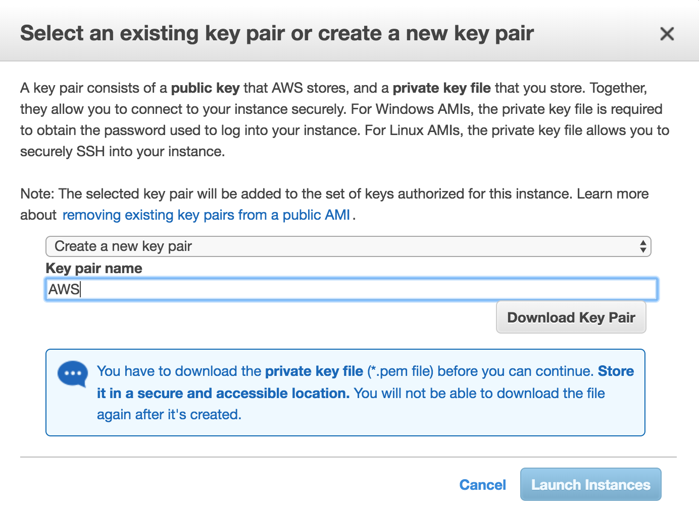
- Give it a name like "mykey" or "AWS"
- Click "Download key pair"
- Click "Launch instance"
- You have launched your first AWS instance!

# 2) Connect to your instance with SSH

- Remember that "AWS.pem" file you downloaded? Find it and move it to your home directory (or any directory).

- Open a terminal window or command prompt on your local PC.

- cd to your home directory.

- Move the downloaded key there.

  ```bash
  MacBook-Pro-8:~ druce$ cp ~/Downloads/AWS.pem .
  ```

- Change its permissions so no one else can access it

  ```bash
  MacBook-Pro-8:~ druce$ chmod 600 AWS.pem
  ```

- By now your instance should have launched. To find the IP address to connect to, go back to your [AWS console](https://console.aws.amazon.com/ec2/v2/#Instances) 


  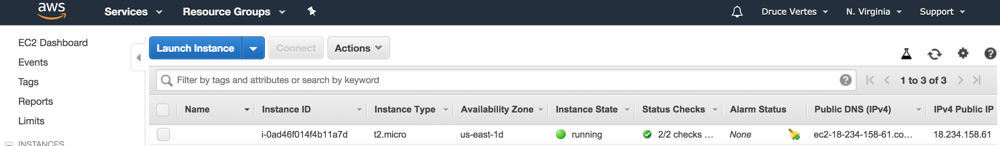

- Click on the instance - hover over "IPv4 Public IP" and click on the little copy icon that appears (or the Public DNS, doesn't really matter)

  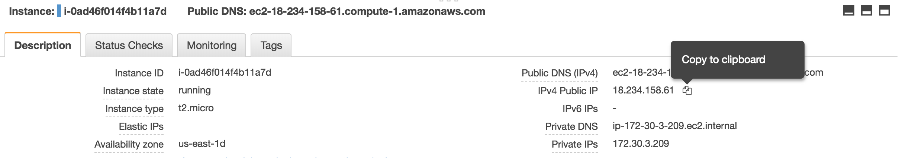

- Go back to your terminal and run this ssh command (paste your own IP or hostname)

  ```bash
  MacBook-Pro-8:~ druce$ ssh -i AWS.pem ubuntu@18.234.158.61
  ```

- Answer 'yes' to any prompt. If you see the Ubuntu bash command prompt, you are in business! 

  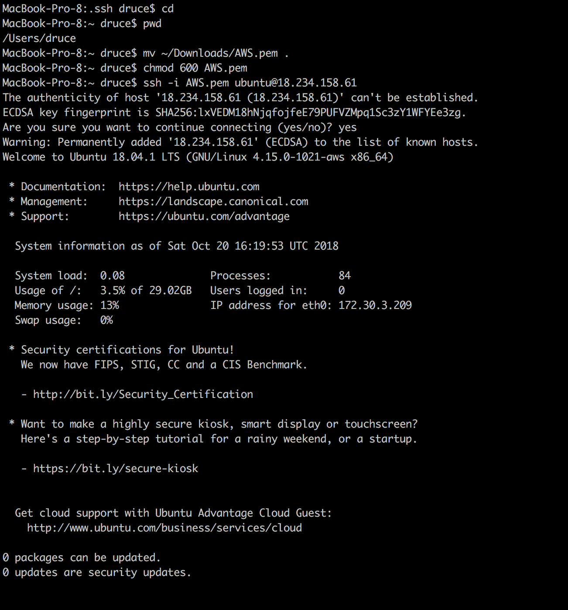

Now we have a running AWS instance! 

# 3) Run installations and updates

- Get ubuntu updates

- ```bash
  ubuntu@ip-172-30-3-209:~ sudo apt update
  ubuntu@ip-172-30-3-209:~ sudo apt upgrade
  ```
  If prompted about config files like grub, choose 'keep local version', tab to OK, hit enter.
  Updates will run for a couple of minutes.
  If you run 'sudo apt upgrade' again you will see this, showing your instance is fully updated.

  ~~~
  ubuntu@ip-172-30-3-209:~$ sudo apt upgrade
  Reading package lists... Done
  Building dependency tree
  Reading state information... Done
  Calculating upgrade... Done
  0 upgraded, 0 newly installed, 0 to remove and 0 not upgraded.
  ~~~

- Ignore the following if you don't understand it: typically I will explicitly update held-back packages and autoremove, until I see nothing left to update

- Next, download the Anaconda installer: Go to the [install page](https://www.anaconda.com/download/#linux) , right-click on the big button for the 3.7 version and copy the link address.

- Go back to the terminal and enter 

  ```bash
  wget <paste url>
  bash ./A<tab to complete>
  ```

Hit enter, spaces to get through all the responses, type yes to accept all the defaults

```bash
ubuntu@ip-172-30-3-209:~$ wget https://repo.anaconda.com/archive/Anaconda3-5.3.0-Linux-x86_64.sh
--2018-10-20 16:30:10--  https://repo.anaconda.com/archive/Anaconda3-5.3.0-Linux-x86_64.sh
Resolving repo.anaconda.com (repo.anaconda.com)... 104.17.111.77, 104.17.107.77, 104.17.108.77, ...
Connecting to repo.anaconda.com (repo.anaconda.com)|104.17.111.77|:443... connected.
HTTP request sent, awaiting response... 200 OK
Length: 667822837 (637M) [application/x-sh]
Saving to: ‘Anaconda3-5.3.0-Linux-x86_64.sh’

Anaconda3-5.3.0-Linux-x86_64.sh                   100%[============================================================================================================>] 636.88M  49.5MB/s    in 11s

2018-10-20 16:30:21 (60.2 MB/s) - ‘Anaconda3-5.3.0-Linux-x86_64.sh’ saved [667822837/667822837]

ubuntu@ip-172-30-3-209:~$ bash ./Anaconda3-5.3.0-Linux-x86_64.sh

Welcome to Anaconda3 5.3.0

In order to continue the installation process, please review the license
agreement.
Please, press ENTER to continue
```

IMPORTANT - when prompted, update .bashrc 

```bash
Do you wish the installer to initialize Anaconda3
in your /home/ubuntu/.bashrc ? [yes|no][no] >>> yes

Initializing Anaconda3 in /home/ubuntu/.bashrc
A backup will be made to: /home/ubuntu/.bashrc-anaconda3.bak

For this change to become active, you have to open a new terminal.

Thank you for installing Anaconda3!

Do you wish to proceed with the installation of Microsoft VSCode? [yes|no]
no
```
- Installation finished!
- IMPORTANT: RESTART TERMINAL (as it helpfully points out, so .bashrc path updates take effect.)
- ctrl-D to exit terminal
- up-arrow to repeat last ssh command

```{bash}
ubuntu@ip-172-30-3-209:~$ logout
Connection to 18.234.158.61 closed.
MacBook-Pro-8:~ druce$ ssh -i AWS.pem ubuntu@18.234.158.61
```

- run python, you should see 3.x, Anaconda build (not Ubuntu stock python)

  ```bash
  ubuntu@ip-172-30-3-209:~$ python
  Python 3.7.0 (default, Jun 28 2018, 13:15:42)
  [GCC 7.2.0] :: Anaconda, Inc. on linux
  Type "help", "copyright", "credits" or "license" for more information.
  >>>
  ```

- Ctrl-D to exit

Almost there! Let's update Anaconda
```bash
  ubuntu@ip-172-30-3-209:~$ conda update --all
  Solving environment: \
```

- Many updates later
```{bash}
bleach-3.0.2         | 219 KB    | ############################################################################################################################################################ | 100%
  Preparing transaction: done
  Verifying transaction: done
  Executing transaction: done
  (base) ubuntu@ip-172-30-3-209:~$
```
- Now you have a running Amazon instance, updated, with Anaconda installed and updated.

#4) Configure and run Jupyter

- Final task is to set up and run Jupyter
- Create a certificate to enable https 
  - Create a certs directory.
  - cd to it.  
  - openssl req -x509 -nodes -days 365 -newkey rsa:1024 -keyout mycert.pem -out mycert.pem
  - I just hit enter for all the values requested

```{bash}
(base) ubuntu@ip-172-30-3-209:~/.jupyter$ cd
(base) ubuntu@ip-172-30-3-209:~$ mkdir certs
(base) ubuntu@ip-172-30-3-209:~$ cd certs
(base) ubuntu@ip-172-30-3-209:~/certs$ openssl req -x509 -nodes -days 365 -newkey rsa:1024 -keyout mycert.pem -out mycert.pem
Generating a 1024 bit RSA private key
...++++++
....++++++

## writing new private key to 'mycert.pem'

You are about to be asked to enter information that will be incorporated
into your certificate request.
What you are about to enter is what is called a Distinguished Name or a DN.
There are quite a few fields but you can leave some blank
For some fields there will be a default value,

## If you enter '.', the field will be left blank.

Country Name (2 letter code) [AU]:
State or Province Name (full name) [Some-State]:
Locality Name (eg, city) []:
Organization Name (eg, company) [Internet Widgits Pty Ltd]:
Organizational Unit Name (eg, section) []:
Common Name (e.g. server FQDN or YOUR name) []:
Email Address []:
```

- Create Jupyter config file and password
  jupyter notebook --generate-config
- Create password
  jupyter notebook password
  enter password twice

```{bash}
(base) ubuntu@ip-172-30-3-209:~$ jupyter notebook --generate-config
Writing default config to: /home/ubuntu/.jupyter/jupyter_notebook_config.py
(base) ubuntu@ip-172-30-3-209:~$ jupyter notebook password
Enter password:
Verify password:
[NotebookPasswordApp] Wrote hashed password to /home/ubuntu/.jupyter/jupyter_notebook_config.json
(base) ubuntu@ip-172-30-3-209:~$
```
- Add these entries to top of .jupyter_notebook_config.json
```{python}
# Kernel config
c.IPKernelApp.pylab = 'inline'  # if you want plotting support always in your notebook

# Notebook config
c.NotebookApp.allow_remote_access = True
c.NotebookApp.certfile = u'/home/ubuntu/certs/mycert.pem' #location of your certificate file
c.NotebookApp.ip = '*'
c.NotebookApp.open_browser = False  #so that the ipython notebook does not opens up a browser by default
# Set the port to 8888, the port we set up in the AWS EC2 set-up
c.NotebookApp.port = 8888
```
- Run Jupyter 

  ```bash
  ubuntu@ip-172-30-1-196:~$ jupyter notebook
  [I 13:31:08.070 NotebookApp] Writing notebook server cookie secret to /run/user/1000/jupyter/notebook_cookie_secret
  [I 13:31:10.881 NotebookApp] JupyterLab extension loaded from /home/ubuntu/anaconda3/lib/python3.7/site-packages/jupyterlab
  [I 13:31:10.881 NotebookApp] JupyterLab application directory is /home/ubuntu/anaconda3/share/jupyter/lab
  [I 13:31:10.883 NotebookApp] Serving notebooks from local directory: /home/ubuntu
  [I 13:31:10.883 NotebookApp] The Jupyter Notebook is running at:
  [I 13:31:10.883 NotebookApp] https://(ip-172-30-1-196 or 127.0.0.1):8888/
  [I 13:31:10.883 NotebookApp] Use Control-C to stop this server and shut down all kernels (twice to skip confirmation).
  
  ```

- Note where it says "The Jupyter Notebook is running at:"

  - Server should be running on all IP addresses (not localhost)
  - Port should be :8888 (If it's e.g. 8889, other servers may be running)

- Go to your browser and connect to https://<your IP>:8888
  IMPORTANT: Use the IP from your AWS console, not the local IP reported by Jupyter startup.
  In Chrome, click "Advanced", ignore the warning and proceed (if Firefox, add an exception)
  (You get a warning because the certificate domain name doesn't match our IP address, which changes every time we launch an AWS instance)

- 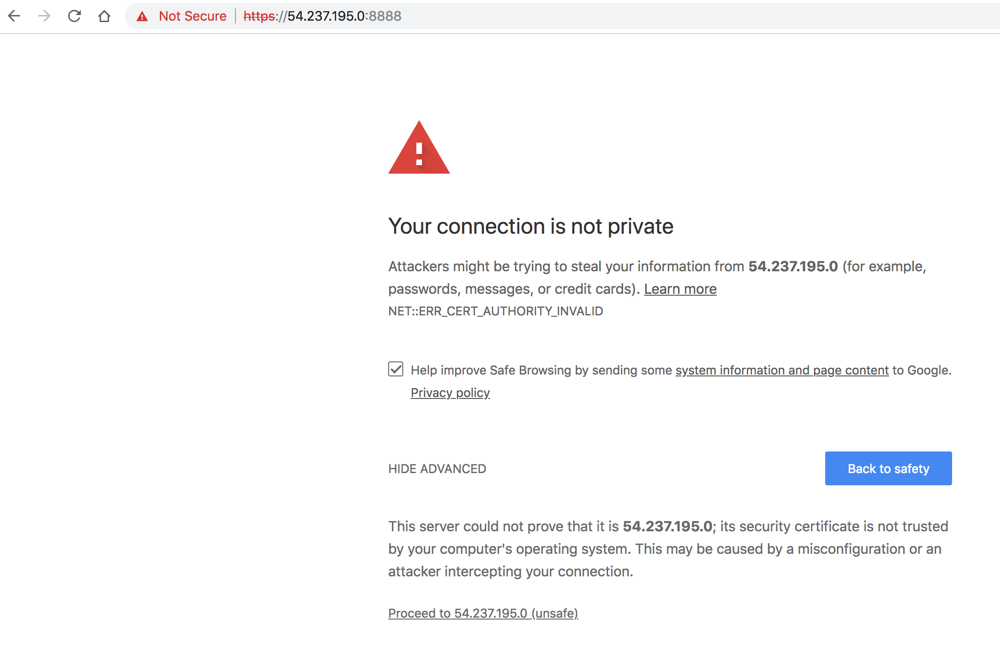

- Enter the Jupyter password you created.
  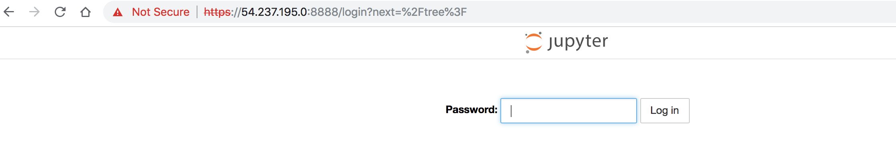

- You are in business!
  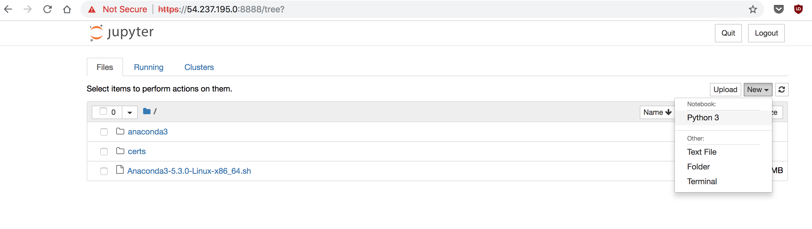
  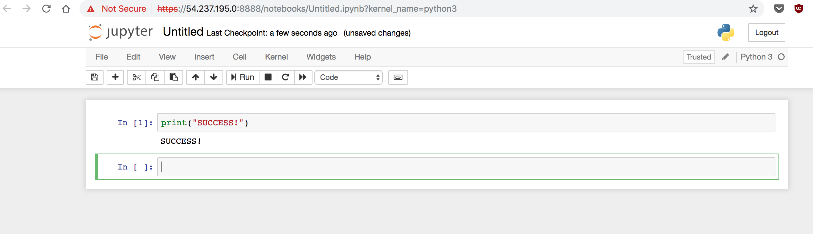


# 5) Final step - image instance for backup

 - Grab a well-earned up of coffee, tea, or whiskey!
 - One last thing is how to create an image of your server. Otherwise you have to do ALL THESE steps again to launch another server.

- Log into the console https://console.aws.amazon.com/ec2/v2/#Instances

- Right-click on your instance, choose Image, Create Image
  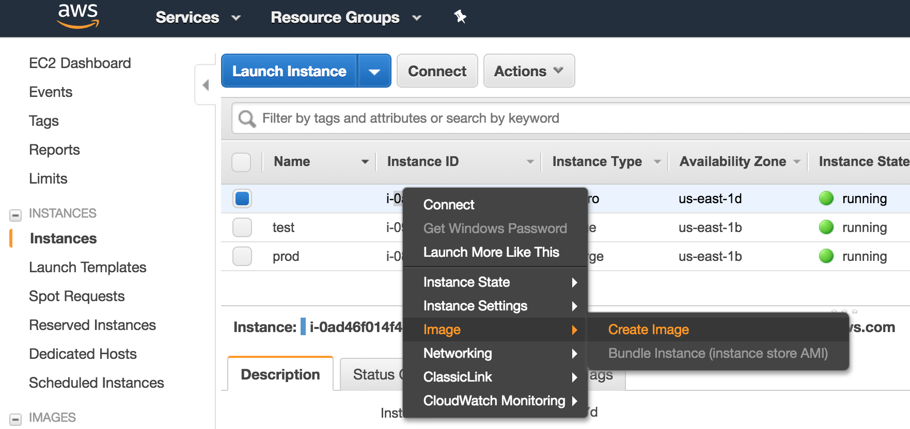

- Give the image a good name, I'll usually go with desc-date. I didn't bother with a good description, but you might put 'Fresh working Jupyter on Ubuntu 18, with all updates'
  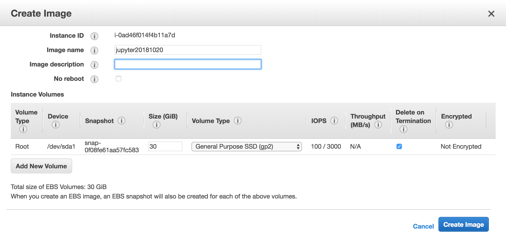

  - Note: this is where you adjust your disk size if you want to increase it (for bigger instances/jobs) or reduce it (save storage)

- Click 'Create image'

  - Note: this will restart your instance

- Creating the image can take 10 mins - go to the AMIs tab and see when it's available. 

- Your running server will reboot and you can reconnect after it finishes booting in a couple of minutes. You can SSH to it using same IP as before. You now have 2 identical running instances.

- When it says 'available' Right-click on image, click Launch instance
  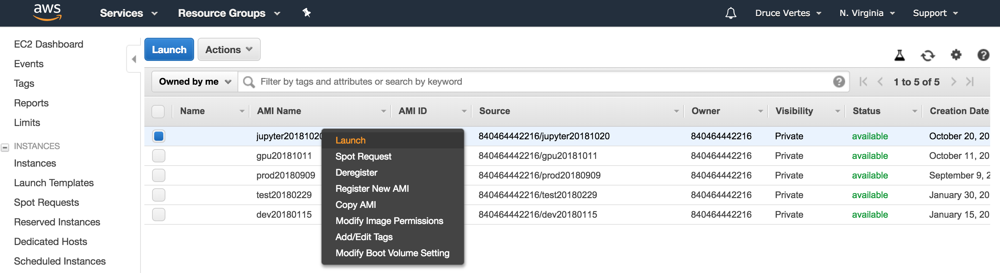

- Choose instance type (e.g. t2.micro)

- Hit next until you get to "Configure Security Group"

- Set the security group you created earlier, e.g. "Jupyter"

- "Review and Launch"

- "Launch"

- You will be prompted for the key pair: Select the one you created before, e.g. "AWS", check the confirmation box, click "Launch Instances"
  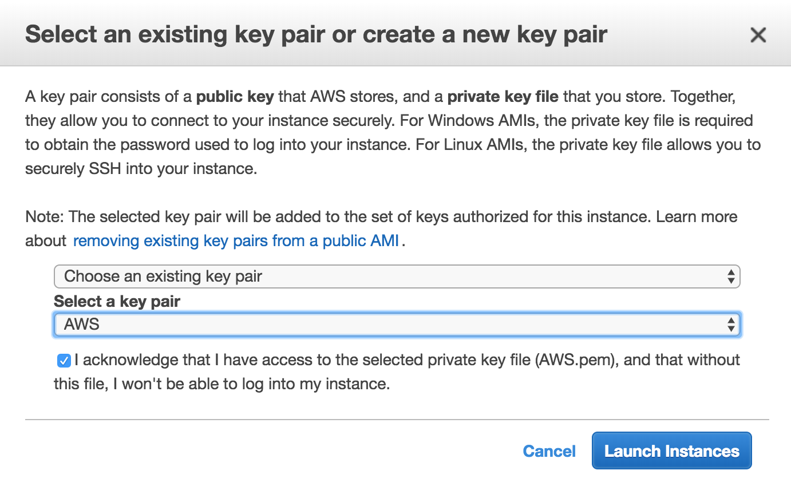

- Go to your instances in the console, wait a couple of minutes, hit refresh to get the new instance's IP

- You can now SSH to the new IP just like the old one. 

  ```bash
  MacBook-Pro-10:~ druce$ ssh -i AWS.pem ubuntu@54.237.195.0
  The authenticity of host '54.237.195.0 (54.237.195.0)' can't be established.
  ECDSA key fingerprint is SHA256:0KCT3Xk/i2tlabHzKQOTYS/joKSL+j0EZ45d/bNwKEc.
  Are you sure you want to continue connecting (yes/no)? yes
  Warning: Permanently added '54.237.195.0' (ECDSA) to the list of known hosts.
  Welcome to Ubuntu 18.04.1 LTS (GNU/Linux 4.15.0-1023-aws x86_64)
   
  ```

- You now have 2 identical running instances.

- To terminate your instances, go to the instances in your console, right-click, choose "Instance State" and choose "Terminate".

  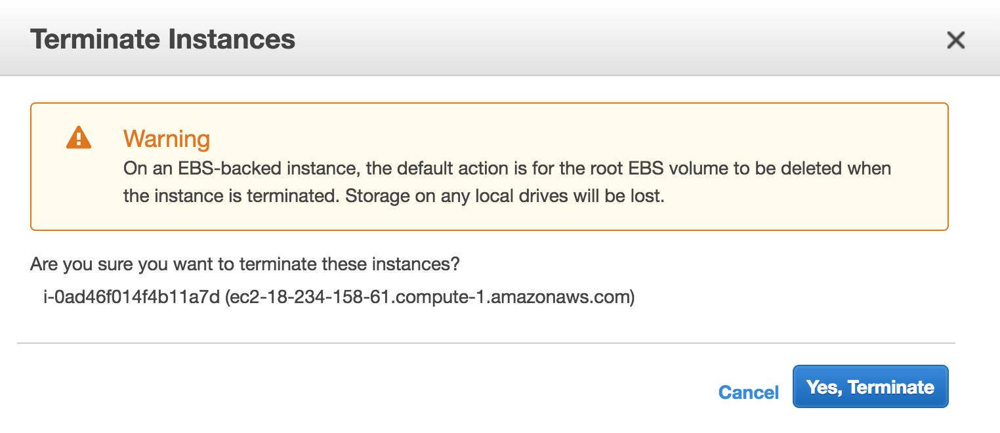
  WARNING: if you have work to save, IMAGE your instance before terminating it.
  When you terminate the instance, everything on it is deleted, so you will lose everything you did since the last image.

- If you aren't going to use your instance for a while, stop it, and if you have made a lot of changes, image it to have as a backup. When you have a lot of images, you may want to clean them up by 'Deregistering' the AMIs and deleting their 'Snapshots'. But by then you will be an AWS expert!

